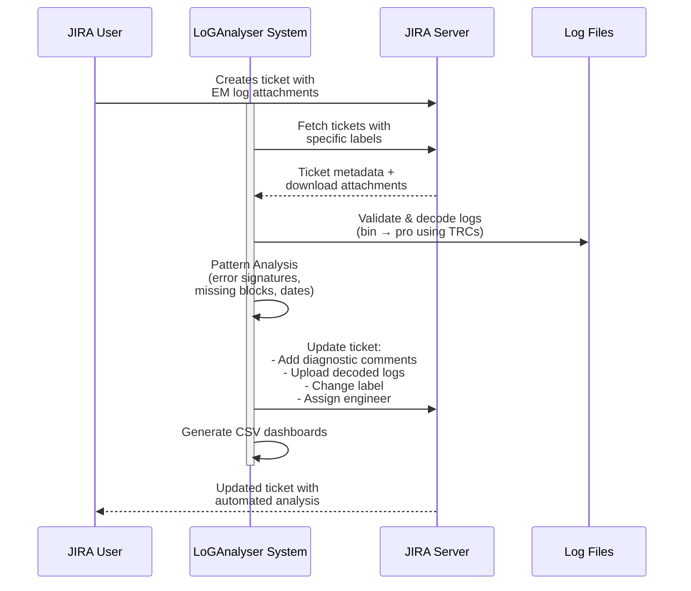
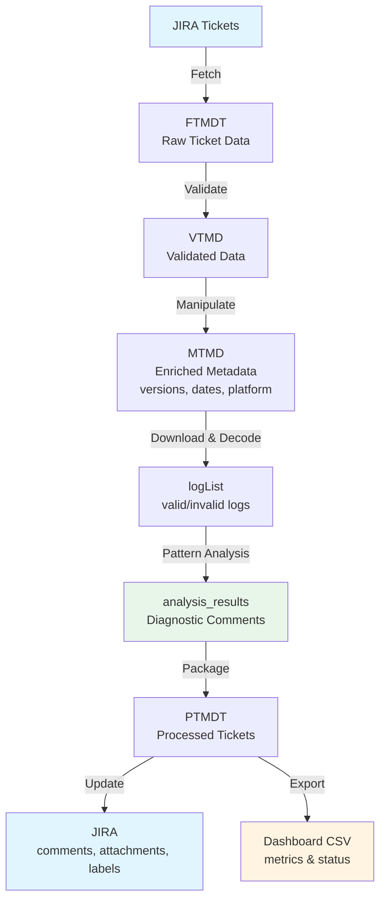
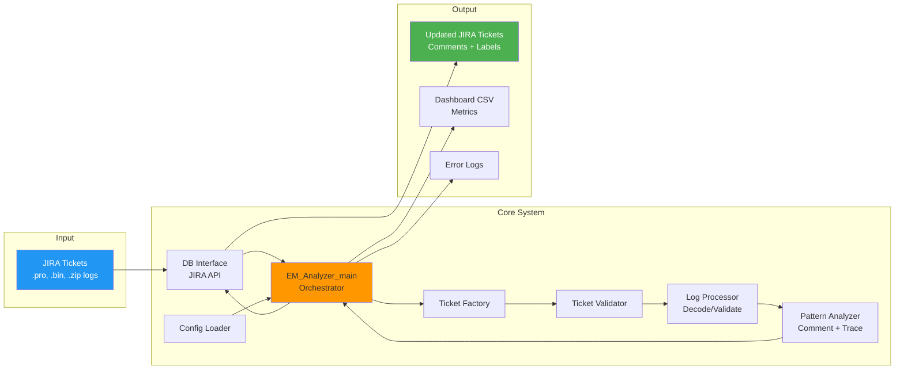
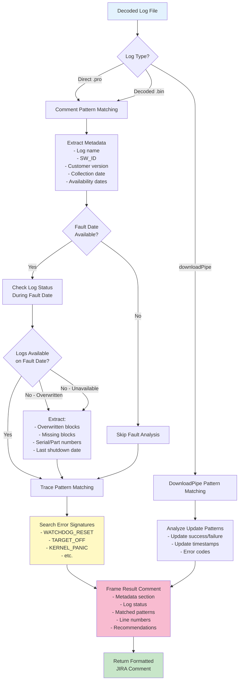
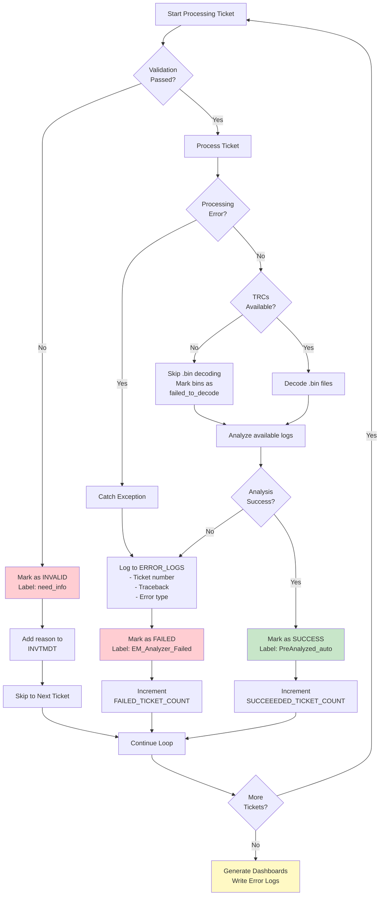

# LoGAnalyser - Sequence Diagram

## Complete System Workflow

```mermaid
sequenceDiagram
    participant Main as EM_Analyzer_main
    participant Config as configSettings
    participant DB as DBInterfacing<br/>(JIRA)
    participant Factory as TicketFactory
    participant Ticket as Ticket
    participant Logs as Logs
    participant Analyzer as Analyzer
    participant Dashboard as Dashboard_Updater

    Note over Main: Phase 1: Configuration & Initialization
    Main->>Config: 1. Load Configs (JSON files)
    Config-->>Main: 2. Return Config Data<br/>(feature, validation, trace patterns)
    
    Note over Main,DB: Phase 2: JIRA Connection & Ticket Fetching
    Main->>DB: 3. initializeDB()
    DB-->>Main: DB_reference (JIRA connection)
    Main->>DB: 4. generateDBQuery(ProjectName, Labels, Components)
    DB-->>Main: JQL Query string
    Main->>DB: 5. fetchDB(query, maxResults, downloadPath)
    Note over DB: - Query JIRA<br/>- Download attachments<br/>- Create ticket folders
    DB-->>Main: 6. FTMDT (List of Ticket Metadata)<br/>[TktNo, SW_ID, Relevance, Brand, Attachments, ...]
    
    Main->>Factory: 7. TicketFactory(FTMDT)
    activate Factory
    
    Note over Main: Phase 3: Ticket Processing Loop
    rect rgb(240, 248, 255)
        Note over Main,Analyzer: FOR EACH TICKET
        
        Main->>Factory: 8. pickTicket(index)
        Factory-->>Main: 9. FTMD (Single Ticket Metadata)
        
        Main->>Ticket: 10. Ticket(FTMD)
        activate Ticket
        
        Main->>Ticket: 11. ValidateTicketData()
        Note over Ticket: Check:<br/>- Attachments present?<br/>- Valid file types?<br/>- Relevance field filled?<br/>- Brand field filled?
        Ticket-->>Main: 12. VTMD (Validation Result)<br/>Status: VALID/INVALID + reasons
        
        alt Ticket is INVALID
            Note over Main: Mark as "need_info"<br/>Add to INVTMDT<br/>Continue to next ticket
        else Ticket is VALID
            Main->>Ticket: 13. ManipulateTicketData(VTMD)
            Note over Ticket: Extract:<br/>- buildVersion<br/>- customerVersion<br/>- platform (gen3/gen4)<br/>- variant (AIVI2, PIVI, etc.)<br/>- faultDate (dd.mm.yy)<br/>- TRC path
            Ticket-->>Main: 14. MTMD (Manipulated Metadata)
            
            Main->>Logs: 15. Logs(MTMD, folderPath)
            activate Logs
            
            Main->>Logs: 16. getLogs()
            Note over Logs: Process Attachments:<br/>1. Categorize (.pro, .bin, .zip)<br/>2. Extract zip files<br/>3. Validate .pro files (check SW_ID)<br/>4. Decode .bin files using TRCs<br/>5. Rename & organize files<br/>6. Move to DirectPro_LOGS/<br/>   Decoded_LOGS/ folders
            Logs-->>Main: 17. logList<br/>[validLogs, invalidLogs, downloadPipeFiles]
            deactivate Logs
            
            Main->>Analyzer: 18. Analyzer(logList, faultDate,<br/>buildVer, custVer, component)
            activate Analyzer
            
            Main->>Analyzer: 19. analyzeLogs()
            
            loop For Each Valid Log
                Note over Analyzer: Comment Pattern Matching:<br/>- Extract log name<br/>- Get actual SW_ID from traces<br/>- Get log collection date<br/>- Get log availability dates<br/>- Check log status during fault date<br/>- Get overwritten/missing blocks<br/>- Extract serial & part numbers<br/>- Generate Hansy link
                
                Note over Analyzer: Trace Pattern Matching:<br/>- Search for error signatures<br/>- Match against configured patterns<br/>- Extract line numbers & dates<br/>- Get recommended components
                
                Note over Analyzer: Frame Result:<br/>- Combine comment parameters<br/>- Add trace matches<br/>- Format for JIRA comment
            end
            
            Analyzer-->>Main: 20. analysis_results<br/>(List of formatted diagnostic comments)
            deactivate Analyzer
            
            Note over Main: Prepare PTMD:<br/>[TktNo, reference, label,<br/>logList, analysis_results,<br/>status, assignee]
        end
    end
    deactivate Ticket
    deactivate Factory
    
    Note over Main,DB: Phase 4: JIRA Update
    rect rgb(255, 250, 240)
        Note over Main: FOR EACH PROCESSED TICKET
        
        loop For Each Log in Ticket
            Main->>DB: 21. add_comment(ticket, analysis_comment)
            Main->>DB: 22. add_attachment(ticket, decoded_log_file)
        end
        
        Main->>DB: 23. Update label<br/>("EM_Analyzer_PreAnalyzed_auto")
        Main->>DB: 24. assign_issue(ticket, assignee)
        
        DB-->>Main: Update Complete
    end
    
    Note over Main,Dashboard: Phase 5: Dashboard & Metrics
    Main->>Dashboard: 25. Dashboard_Updater(PTMDT, METRICS)
    activate Dashboard
    Main->>Dashboard: 26. updateDataDashboard()
    Note over Dashboard: Write Errmem_Dashboard.csv:<br/>- Ticket number<br/>- Status (label)<br/>- ARTA comment<br/>- Assignee
    Main->>Dashboard: 27. updateMetricsDashboard()
    Note over Dashboard: Write Errmem_Metrics.csv:<br/>- PROCESSED_TICKET_COUNT<br/>- SUCCEEEDED_TICKET_COUNT<br/>- FAILED_TICKET_COUNT
    deactivate Dashboard
    
    Note over Main: Phase 6: Error Logging
    alt Errors Occurred
        Note over Main: BuildLogCreator writes Error_log.csv:<br/>- Ticket number<br/>- Error traceback<br/>- Error type
    end
    
    Note over Main: Processing Complete!
```

---

## Simplified High-Level Flow

---

## Data Flow Diagram

---

## Component Architecture

---

## Pattern Matching Flow

---

## Error Handling Strategy

---

## Legend

| Symbol | Meaning |
|--------|---------|
| **→** | Synchronous call |
| **-->>** | Return/Response |
| **activate/deactivate** | Object lifecycle |
| **rect** | Grouping/Loop |
| **alt** | Conditional branch |
| **loop** | Iteration |
| **Note** | Comments/Explanations |

---

## Key Takeaways

1. **Highly Automated**: Minimal manual intervention required
2. **Robust Error Handling**: Multiple fallback strategies
3. **Pattern-Driven**: Easy to add new error signatures via JSON configs
4. **Scalable**: Processes multiple tickets in batch
5. **Traceable**: Comprehensive logging and dashboards
6. **Modular**: Each phase is independent and can be enhanced separately

---

## Technologies Used

- **Python 3.x**
- **JIRA Python API** (jira library)
- **Pattern Matching** (regex + text search)
- **CSV** (pandas/csv for dashboards)
- **File Processing** (zipfile, shutil, os)
- **JSON Configuration** (config files)
